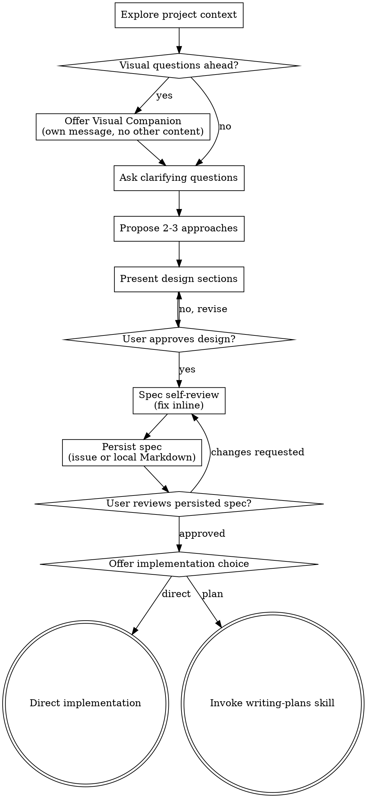

# Brainstorming Ideas Into Designs

Help turn ideas into fully formed designs and specs through natural collaborative dialogue.

Start by understanding the current project context, then ask questions one at a time to refine the idea. Once you understand what you're building, present the design and get user approval.

<HARD-GATE>
Do NOT invoke any implementation skill, write any code, scaffold any project, or take any implementation action until you have presented a design and the user has approved it. This applies to EVERY project regardless of perceived simplicity.
</HARD-GATE>

## Anti-Pattern: "This Is Too Simple To Need A Design"

Every project goes through this process. A todo list, a single-function utility, a config change — all of them. "Simple" projects are where unexamined assumptions cause the most wasted work. The design can be short (a few sentences for truly simple projects), but you MUST present it and get approval.

## Checklist

You MUST create a task for each of these items and complete them in order:

1. **Explore project context** — check files, docs, recent commits
2. **Offer visual companion** (if topic will involve visual questions) — this is its own message, not combined with a clarifying question. See the Visual Companion section below.
3. **Ask clarifying questions** — one at a time, understand purpose/constraints/success criteria
4. **Propose 2-3 approaches** — with trade-offs and your recommendation
5. **Present design** — in sections scaled to their complexity, get user approval after each section
6. **Spec self-review** — quick inline check for placeholders, contradictions, ambiguity, scope before persisting (see below)
7. **Persist spec** — update/create GitHub issue or write local Markdown fallback (see After the Design)
8. **User reviews persisted spec** — ask user to review the issue or spec file before proceeding
9. **Choose implementation path** — ask whether to start direct implementation or write an implementation plan

## Process Flow

**The terminal state is choosing the implementation path.** After the persisted SPEC is approved, ask whether to start direct implementation or write an implementation plan. Do not invoke implementation skills before the user chooses direct implementation or asks for a plan.

## The Process

**Understanding the idea:**

- Check out the current project state first (files, docs, recent commits)
- Before asking detailed questions, assess scope: if the request describes multiple independent subsystems (e.g., "build a platform with chat, file storage, billing, and analytics"), flag this immediately. Don't spend questions refining details of a project that needs to be decomposed first.
- If the project is too large for a single spec, help the user decompose into sub-projects: what are the independent pieces, how do they relate, what order should they be built? Then brainstorm the first sub-project through the normal design flow. Each sub-project gets its own spec → plan → implementation cycle.
- If decomposition creates multiple sub-project issues, the final created-issues summary must list each sub-project issue with its full GitHub issue URL.
- For appropriately-scoped projects, ask questions one at a time to refine the idea
- Prefer multiple choice questions when possible, but open-ended is fine too
- Only one question per message - if a topic needs more exploration, break it into multiple questions
- Focus on understanding: purpose, constraints, success criteria

**Exploring approaches:**

- Propose 2-3 different approaches with trade-offs
- Present options conversationally with your recommendation and reasoning
- Lead with your recommended option and explain why

**Presenting the design:**

- Once you believe you understand what you're building, present the design
- Scale each section to its complexity: a few sentences if straightforward, up to 200-300 words if nuanced
- Ask after each section whether it looks right so far
- Cover: architecture, components, data flow, error handling, testing
- Be ready to go back and clarify if something doesn't make sense

**Design for isolation and clarity:**

- Break the system into smaller units that each have one clear purpose, communicate through well-defined interfaces, and can be understood and tested independently
- For each unit, you should be able to answer: what does it do, how do you use it, and what does it depend on?
- Can someone understand what a unit does without reading its internals? Can you change the internals without breaking consumers? If not, the boundaries need work.
- Smaller, well-bounded units are also easier for you to work with - you reason better about code you can hold in context at once, and your edits are more reliable when files are focused. When a file grows large, that's often a signal that it's doing too much.

**Working in existing codebases:**

- Explore the current structure before proposing changes. Follow existing patterns.
- Where existing code has problems that affect the work (e.g., a file that's grown too large, unclear boundaries, tangled responsibilities), include targeted improvements as part of the design - the way a good developer improves code they're working in.
- Don't propose unrelated refactoring. Stay focused on what serves the current goal.

## After the Design

**Spec Persistence:**

First, write the validated design (SPEC) using the existing design-doc format. Use elements-of-style:writing-clearly-and-concisely skill if available. Then run Spec Self-Review before writing the SPEC anywhere.

Choose the persistence destination:

- If the original user input was a GitHub issue URL, update that issue.
- If the original user input was not a GitHub issue URL, ask whether to create a GitHub issue or write local Markdown.
- If the user chooses local Markdown, use the local Markdown spec flow below.

GitHub issue creation:

1. Infer the target GitHub repository from the current repo's GitHub remote.
2. If the remote is missing, non-GitHub, or ambiguous, ask the user for the target repository.
3. Generate an issue title from the SPEC topic.
4. Show the target repository, operation, title, and a brief summary of the SPEC body.
5. Ask for confirmation before creating or updating a remote issue.
6. Create the issue with the full SPEC as the issue body.

GitHub issue updates:

1. Show the issue URL, operation, and a brief summary of the replacement SPEC body.
2. Ask for confirmation before creating or updating a remote issue.
3. Then replace the issue body with the full SPEC.
4. Then add a short comment summarizing the main changes from this brainstorming round.

The issue body is always the current SPEC. Comments are only a compact change log; they must not replace the body or duplicate the entire SPEC.

GitHub tooling:

- Use whatever write-capable GitHub tool exists in the environment, such as GitHub CLI, GitHub MCP, or harness-provided issue tooling.
- If no write-capable GitHub tool is available, or if authentication, permission, network, repository, or issue writes fail, explain the failure and fall back to the local Markdown spec flow unless the user chooses to stop.
- Never claim that an issue was created or updated unless the write operation succeeded.

GitHub result reporting:

- For result summaries after creating or updating GitHub issues, include the full GitHub issue URL (`https://github.com/<owner>/<repo>/issues/<number>`). Do not report only `#123` in these summaries.
- A short `#123` reference is fine for intermediate progress, reasoning, and compact cross-references.
- If creating several sub-project issues during decomposition, the final summary must include the full GitHub issue URL for every created issue.
- Prefer the URL returned by the GitHub tool. If only a number is returned, construct the URL from the target repository and issue number.

Local Markdown spec flow:

- Write the validated SPEC to `docs/superpowers/specs/YYYY-MM-DD-<topic>-design.md`
  - (User preferences for spec location override this default)
- Commit the design document to git

**Spec Self-Review:**
Before persisting the SPEC to a GitHub issue or local Markdown, look at it with fresh eyes:

1. **Placeholder scan:** Any "TBD", "TODO", incomplete sections, or vague requirements? Fix them.
2. **Internal consistency:** Do any sections contradict each other? Does the architecture match the feature descriptions?
3. **Scope check:** Is this focused enough for a single implementation plan, or does it need decomposition?
4. **Ambiguity check:** Could any requirement be interpreted two different ways? If so, pick one and make it explicit.

Fix any issues inline. No need to re-review — just fix and move on.

**User Review Gate:**
After the spec review loop passes and the SPEC has been persisted, ask the user to review the persisted spec before proceeding:

> "Spec persisted to `<issue-url-or-path>`. Please review it and let me know if you want any changes. Once you approve it, choose: 1. Direct implementation, or 2. Write implementation plan."

If the SPEC was persisted to a GitHub issue, `<issue-url-or-path>` must be the full GitHub issue URL, not a short `#123` reference.

Wait for the user's response. If they request changes, make them and re-run the spec review loop. Only proceed once the user approves.

**Implementation:**

After the user approves the persisted SPEC, offer two paths:

1. **Direct implementation** - start development from the approved SPEC without writing a separate plan. Use this for small, low-risk changes with clear scope. Create a concise task checklist, define the verification approach up front, and verify before completion.
2. **Write implementation plan** - invoke the writing-plans skill to create a detailed implementation plan. If the SPEC was persisted to a GitHub issue, tell writing-plans to post the plan as a comment on the issue.

Recommend writing a plan for large, high-risk, multi-file, ambiguous, or long-running work. If the user chooses direct implementation, do not create a plan file.

## Key Principles

- **One question at a time** - Don't overwhelm with multiple questions
- **Multiple choice preferred** - Easier to answer than open-ended when possible
- **YAGNI ruthlessly** - Remove unnecessary features from all designs
- **Explore alternatives** - Always propose 2-3 approaches before settling
- **Incremental validation** - Present design, get approval before moving on
- **Be flexible** - Go back and clarify when something doesn't make sense

## Visual Companion

A browser-based companion for showing mockups, diagrams, and visual options during brainstorming. Available as a tool — not a mode. Accepting the companion means it's available for questions that benefit from visual treatment; it does NOT mean every question goes through the browser.

**Offering the companion:** When you anticipate that upcoming questions will involve visual content (mockups, layouts, diagrams), offer it once for consent:
> "Some of what we're working on might be easier to explain if I can show it to you in a web browser. I can put together mockups, diagrams, comparisons, and other visuals as we go. This feature is still new and can be token-intensive. Want to try it? (Requires opening a local URL)"

**This offer MUST be its own message.** Do not combine it with clarifying questions, context summaries, or any other content. The message should contain ONLY the offer above and nothing else. Wait for the user's response before continuing. If they decline, proceed with text-only brainstorming.

**Per-question decision:** Even after the user accepts, decide FOR EACH QUESTION whether to use the browser or the terminal. The test: **would the user understand this better by seeing it than reading it?**

- **Use the browser** for content that IS visual — mockups, wireframes, layout comparisons, architecture diagrams, side-by-side visual designs
- **Use the terminal** for content that is text — requirements questions, conceptual choices, tradeoff lists, A/B/C/D text options, scope decisions

A question about a UI topic is not automatically a visual question. "What does personality mean in this context?" is a conceptual question — use the terminal. "Which wizard layout works better?" is a visual question — use the browser.

If they agree to the companion, read the detailed guide before proceeding:
`skills/brainstorming/visual-companion.md`
