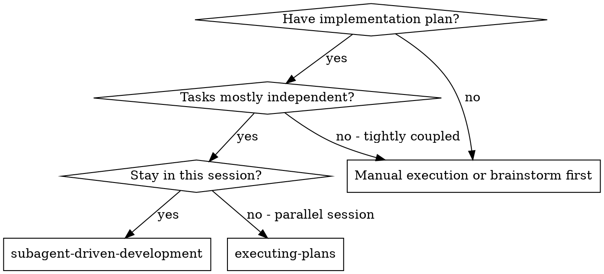
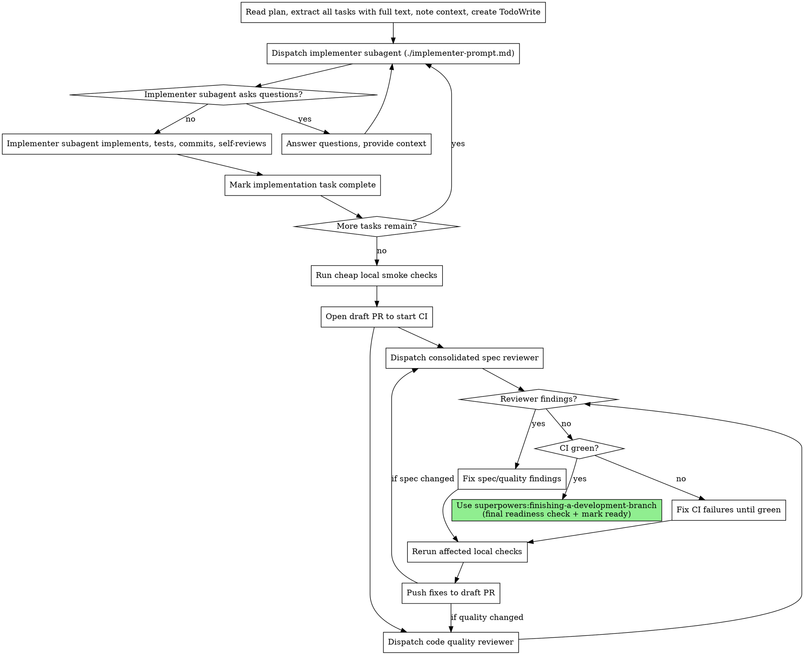

# Subagent-Driven Development

Execute plan by dispatching fresh implementer subagents, opening a draft PR early so CI runs while consolidated reviews happen, then fixing reviewer findings and CI failures before marking the PR ready.

**Why subagents:** You delegate tasks to specialized agents with isolated context. By precisely crafting their instructions and context, you ensure they stay focused and succeed at their task. They should never inherit your session's context or history — you construct exactly what they need. This also preserves your own context for coordination work.

**Core principle:** Fresh implementer per task + early draft PR/CI + consolidated reviews = fast flow with strong final gates.

**Continuous execution:** Do not pause to check in with your human partner between tasks. Execute all tasks from the plan without stopping. The only reasons to stop are: BLOCKED status you cannot resolve, ambiguity that genuinely prevents progress, or all tasks complete. "Should I continue?" prompts and progress summaries waste their time — they asked you to execute the plan, so execute it.

## When to Use



**vs. Executing Plans (parallel session):**
- Same session (no context switch)
- Fresh subagent per task (no context pollution)
- Draft PR opens early so GitHub CI runs while reviewers work
- Consolidated spec and code quality reviews after implementation, not per-task gates
- Faster iteration with fewer stop-start review loops

## The Process



## Review and CI Flow

After all implementer tasks finish local commits:

1. Run cheap local smoke checks (`git diff --check`, formatting checks, focused tests, or the fastest meaningful project check).
2. Push the branch and open draft PR to start CI. Use `gh pr create --draft` when GitHub CLI is available.
3. While CI runs, dispatch a consolidated spec reviewer with the full SPEC/plan and the complete branch diff.
4. While CI runs, dispatch a code quality reviewer with the full branch diff and implementation context.
5. Fix blocking spec and quality findings, rerun affected local checks, commit, and push fixes to the draft PR.
6. Watch CI and fix CI failures until green.
7. Use `superpowers:finishing-a-development-branch` for the final readiness check and to mark PR ready.

CI and reviewer subagents are both review mechanisms. CI checks mechanical facts; reviewers check requirements and engineering judgment.

## Model Selection

Prefer smarter implementer subagents while still considering cost and latency. Bad implementation work is more expensive than a stronger model.

**Match the current main session model family for stronger implementers.** The main session's large model is the default reference point:

- If the current session is Codex, use a strong Codex model for development subagents when a large model is appropriate.
- If the current session is Claude Code, use Sonnet for development subagents when a large model is appropriate.
- If the current session uses another model family, prefer that family's strong coding model unless there is a clear reason to switch.

When dispatching subagents with a different or explicitly selected model, enable that model's maximum available thinking/reasoning effort. Do this for strong development subagents and for reviewer subagents; the point of choosing a stronger model is to let it think fully.

**Prefer the smarter model for implementation by default when:**
- The task touches multiple files
- The task changes shared behavior, public APIs, auth, persistence, build/release, or CI
- The task requires reading unfamiliar code or making design judgments
- A wrong implementation would create expensive review or CI churn

**Use cheaper/faster models only for truly mechanical tasks** with complete plan steps, isolated files, and low blast radius.

**Architecture, design, consolidated spec review, and code quality review tasks**: use the most capable available model with maximum available thinking/reasoning effort.

**Task complexity signals:**
- Touches 1 isolated file with complete instructions and obvious tests → cheaper/faster model acceptable
- Touches 2+ files or has integration concerns → strong model from current main session family
- Requires design judgment, broad codebase understanding, or reviewer authority → most capable available model

## Handling Implementer Status

Implementer subagents report one of four statuses. Handle each appropriately:

**DONE:** Mark the implementation task complete and continue to the next task. Do not dispatch per-task spec or code quality reviewers.

**DONE_WITH_CONCERNS:** The implementer completed the work but flagged doubts. Read the concerns before proceeding. If the concerns are about correctness or scope, address them before review. If they're observations (e.g., "this file is getting large"), note them and proceed to review.

**NEEDS_CONTEXT:** The implementer needs information that wasn't provided. Provide the missing context and re-dispatch.

**BLOCKED:** The implementer cannot complete the task. Assess the blocker:
1. If it's a context problem, provide more context and re-dispatch with the same model
2. If the task requires more reasoning, re-dispatch with a more capable model
3. If the task is too large, break it into smaller pieces
4. If the plan itself is wrong, escalate to the human

**Never** ignore an escalation or force the same model to retry without changes. If the implementer said it's stuck, something needs to change.

## Prompt Templates

- `./implementer-prompt.md` - Dispatch implementer subagent
- `./spec-reviewer-prompt.md` - Dispatch consolidated spec reviewer after all implementation tasks
- `./code-quality-reviewer-prompt.md` - Dispatch code quality reviewer after draft PR is open

## Example Workflow

```
You: I'm using Subagent-Driven Development to execute this plan.

[Read plan or issue comment once]
[Extract all 5 tasks with full text and context]
[Create TodoWrite with all tasks]

Task 1: Hook installation script

[Get Task 1 text and context (already extracted)]
[Dispatch implementation subagent with full task text + context]

Implementer: "Before I begin - should the hook be installed at user or system level?"

You: "User level (~/.config/superpowers/hooks/)"

Implementer: "Got it. Implementing now..."
[Later] Implementer:
  - Implemented install-hook command
  - Added tests, 5/5 passing
  - Self-review: Found I missed --force flag, added it
  - Committed

[Mark Task 1 complete]

Task 2: Recovery modes

[Get Task 2 text and context (already extracted)]
[Dispatch implementation subagent with full task text + context]

Implementer: [No questions, proceeds]
Implementer:
  - Added verify/repair modes
  - 8/8 tests passing
  - Self-review: All good
  - Committed

[Mark Task 2 complete]

...

[After all tasks]
[Run cheap local smoke checks]
[Open draft PR to start CI]
[Dispatch consolidated spec reviewer while CI runs]
Spec reviewer: ❌ Missing progress reporting required by SPEC
[Dispatch code quality reviewer while CI runs]
Code reviewer: Important: Magic number (100)
[Fix both findings, rerun affected checks, commit, push]
[Watch CI and fix failures until green]
[Use finishing-a-development-branch for final readiness check]

Done!
```

## Advantages

**vs. Manual execution:**
- Subagents follow the plan's verification strategy naturally
- Fresh context per task (no confusion)
- Parallel-safe (subagents don't interfere)
- Subagent can ask questions (before AND during work)

**vs. Executing Plans:**
- Same session (no handoff)
- Continuous implementation progress before review gates
- Draft PR starts CI while reviewers work
- Review checkpoints are consolidated instead of per-task

**Efficiency gains:**
- No file reading overhead (controller provides full text)
- Controller curates exactly what context is needed
- Subagent gets complete information upfront
- Questions surfaced before work begins (not after)

**Quality gates:**
- Self-review catches issues before handoff
- Consolidated spec review checks the whole implementation against the SPEC/plan
- Code quality review checks the whole branch/PR diff
- GitHub CI verifies build, tests, lint, and other mechanical checks
- Review loops ensure fixes actually work
- Spec compliance prevents over/under-building
- Code quality ensures implementation is well-built

**Cost:**
- Fewer reviewer subagent invocations than per-task review
- Controller does more prep work (extracting all tasks upfront)
- Draft PR/CI setup adds a remote step
- But catches issues early (cheaper than debugging later)

## Red Flags

**Never:**
- Start implementation on main/master branch without explicit user consent
- Skip consolidated spec review or code quality review
- Proceed with unfixed issues
- Dispatch multiple implementation subagents in parallel (conflicts)
- Make subagent read plan file (provide full text instead)
- Skip scene-setting context (subagent needs to understand where task fits)
- Ignore subagent questions (answer before letting them proceed)
- Accept "close enough" on spec compliance (consolidated spec reviewer found issues = not done)
- Skip review loops (reviewer found issues = implementer fixes = review again)
- Let implementer self-review replace actual review (both are needed)
- Mark PR ready before CI is green and reviewer findings are resolved
- Leave draft PR CI red without fixing or explaining the blocker

**If subagent asks questions:**
- Answer clearly and completely
- Provide additional context if needed
- Don't rush them into implementation

**If reviewer finds issues:**
- Dispatch a fix subagent with the reviewer findings and relevant context
- Rerun affected local checks
- Push fixes to the draft PR
- Re-review only the affected area unless the change is broad
- Don't skip the re-review

**If subagent fails task:**
- Dispatch fix subagent with specific instructions
- Don't try to fix manually (context pollution)

## Integration

**Required workflow skills:**
- **superpowers:using-git-worktrees** - Ensures isolated workspace (creates one or verifies existing)
- **superpowers:writing-plans** - Creates the plan this skill executes
- **superpowers:requesting-code-review** - Code review template for reviewer subagents
- **superpowers:finishing-a-development-branch** - Complete development after all tasks

**Subagents should use:**
- **superpowers:verification-before-completion** - Evidence before reporting task completion
- **superpowers:test-driven-development** - Bug-fix tasks only, when reproducing and fixing regressions

**Alternative workflow:**
- **superpowers:executing-plans** - Use for parallel session instead of same-session execution
