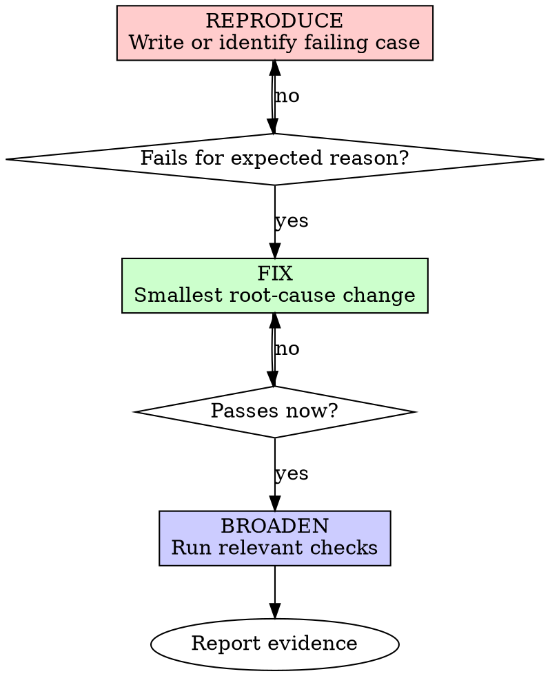

# Bug-Fix Test-Driven Development

## Overview

Use TDD for bug fixes and regressions: reproduce the failure, prove an automated test or repro catches it, make the smallest fix, then verify the failure stays fixed.

**Core principle:** A bug fix is trustworthy only when you have evidence that the old behavior failed and the new behavior passes.

This skill is **not** the default workflow for new features. Feature work should follow the plan's verification strategy and `superpowers:verification-before-completion`.

## When to Use

**Use for:**
- Bugs
- Regressions
- Failing tests
- Unexpected behavior
- Production defects
- User-reported broken behavior

**Do not use for:**
- New features
- Pure refactors
- Planned behavior additions
- Documentation-only changes
- Configuration-only changes

If the user explicitly asks for TDD on feature work, follow the user's instruction.

## The Bug-Fix Rule

```
NO BUG FIX WITHOUT A FAILING REPRODUCTION FIRST
```

For automated codebases, the reproduction should be an automated regression test. If no test harness can exercise the bug, use the smallest reproducible script or documented manual repro and explain why automation is not practical.

Already wrote the fix before the regression test? Prove the test catches the original bug by temporarily reverting the fix, running the test and seeing it fail, then restoring the fix and seeing it pass.

## Reproduce-Fix-Verify



### 1. Reproduce the Bug

Create one minimal failing case that demonstrates the reported broken behavior.

Good regression tests:
- Exercise real code
- Fail without the fix
- Fail for the bug, not for setup errors
- Describe the behavior users care about

```typescript
test('rejects an empty email during signup', async () => {
  const result = await submitSignup({ email: '', password: 'secret123' });

  expect(result.ok).toBe(false);
  expect(result.error).toBe('Email is required');
});
```

### 2. Verify the Failure

Run the narrowest command that exercises the reproduction.

```bash
npm test signup.test.ts -- --runInBand
```

Confirm:
- The test fails
- The failure is expected
- The failure explains the original bug

If the test passes, it does not reproduce the bug. Fix the test or find a better reproduction before changing production code.

### 3. Fix the Root Cause

Make the smallest code change that addresses the confirmed root cause.

Do not:
- Bundle unrelated refactors
- Add speculative improvements
- Change multiple suspected causes at once
- Weaken the regression test to make it pass

### 4. Verify the Fix

Run the reproduction again. It must pass.

Then run the relevant surrounding checks:
- The affected test file or package test
- Any related integration or e2e test
- Build/typecheck/lint if the touched area requires it

## If You Cannot Automate the Repro

Use a manual or script-based repro only when automation is not practical.

Document:
- Exact steps to reproduce
- Expected broken result before the fix
- Actual fixed result after the fix
- Why this could not be automated

Still prefer an automated test whenever the codebase gives you a reasonable path.

## Relationship to Debugging

For unclear bugs, use `superpowers:systematic-debugging` first. Once the root cause is understood, use this skill to lock in the fix with a failing reproduction and passing verification.

## Common Rationalizations

| Excuse | Reality |
|--------|---------|
| "I can see the bug in the code" | Seeing a symptom is not proof the fix works. Reproduce it. |
| "I'll add the regression test after" | Then you never proved the test catches the old bug. |
| "This is too small to test" | Small fixes regress too. Use the smallest repro. |
| "The existing failing test is enough" | Only if it fails for the same user-visible bug. |
| "Manual testing is faster" | Manual repro is acceptable only when automation is not practical. |
| "I already fixed it" | Temporarily revert or otherwise prove the repro fails without the fix. |

## Red Flags

- Starting a bug fix without reproducing the bug
- Fixing several suspected causes at once
- A regression test that passes before the fix
- A failure caused by test setup rather than the bug
- Removing or weakening assertions to get green
- Claiming "fixed" without fresh verification output

## Verification Checklist

Before reporting the bug fixed:

- [ ] Reproduction exists
- [ ] Reproduction failed for the expected reason before the fix
- [ ] Fix is scoped to the root cause
- [ ] Reproduction passes after the fix
- [ ] Relevant surrounding checks pass
- [ ] Verification evidence is included in the report

Can't check these boxes? The fix is not proven yet.
